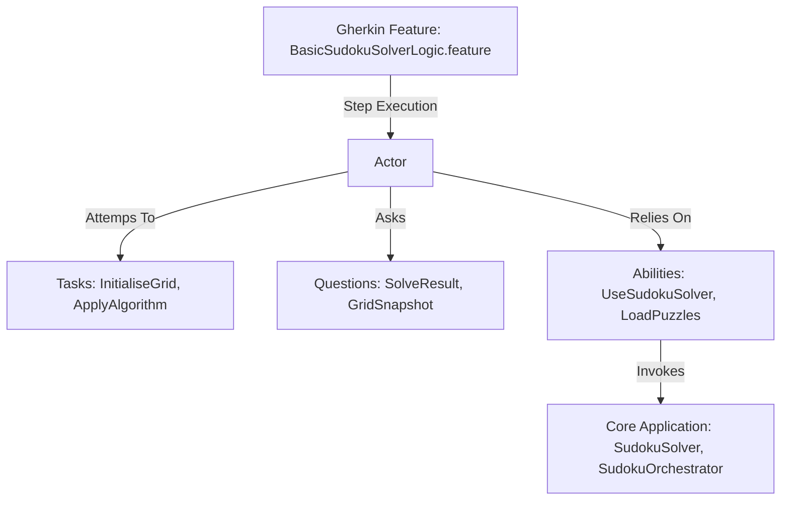

# Architecture Assessment

---

## Core Screenplay Principles Alignment

The system demonstrates exceptional compliance with the core tenants of Screenplay BDD:

* **Separation of Concerns**: The separation of layer-3 actors (which consume Tasks, Questions, and Abilities) from core execution layers avoids test framework leaks into core application logic. Both `SudokuSolver` and its orchestrators remain completely independent, enabling them to be easily refactored, updated, or re-packaged.
* **Isolated Actor Notes**: Instead of storing transient scenario state inside stepping hooks (creating stateful step-definitions), states are loaded into actor memories.
* **Declarative Step Definitions**: Stepping files only contain simple, declarative statements delegating execution paths to actors:
  ```typescript
  // TypeScript step definition delegation
  await actor.attemptsTo(
      InitialiseGrid.with(grid)
  );
  ```
  This strategy maintains high logic separation and prevents step definitions from becoming bloated procedural scripts.

---

## Compliance with Reference Architecture v1.15

Following decisions `DR-012` through `DR-033`, the repository conforms excellently to Reference Architecture (RA) v1.15 design rules:



* **No Side-Channel State Mutators**: Mutating states across step contexts is completely prohibited. State isolations are strictly maintained via Actor Memory notes.
* **Consistent Folder Structures**: File kebab-casing guidelines (`DR-020`) and kebab-case directory alignments (`DR-019`) are adhered to. New evaluations and review logs are directed inside the compliant dot-starting kebab-case folder `DOCS/.review/` (remedying `RA v1.14` review locations under `DR-029`).
* **Containerized Virtualization**: Conforms to `DR-033` through a lightweight local multi-stack virtualization harness. Compose configurations allocate host port bindings efficiently and use high-performance, small-footprint Alpine bases.

---

## Multi-Stack Code Reuse and Future Scaling

The current repository framework is exceptionally scalable. Adding a new language stack (for example, a Go or Rust screenplay harness) can be easily done using the established blueprint:
1. Copy the canonical feature file from `features-shared/`.
2. Craft the standard `Actor` memory interface (translating `attemptsTo` and `answer`).
3. Port the simple 9x9 Unit Completion, Hidden Singles, and Naked Singles logical loops.
4. Establish custom Step Definitions to map matching strings.
5. Create a local `/docs` folder following lowercase kebab-case naming specifications.
6. Register the local stack parameters inside `.batch/run-parity-checks.ps1` to ensure compliance.
